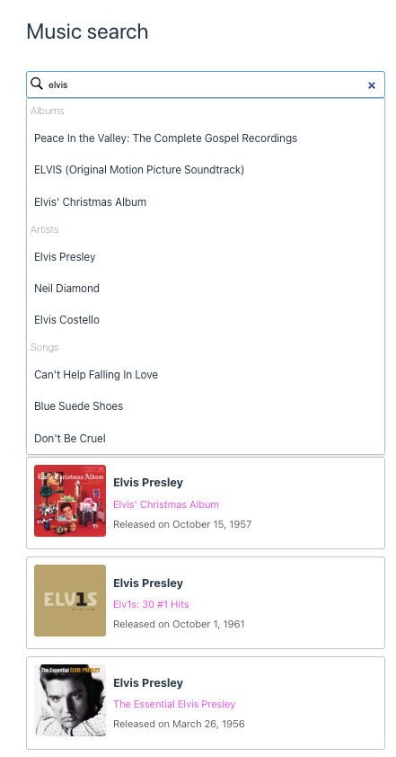

# iTunes Music Search App

This project is a solution for the Comgy code challenge for frontend engineers. It is a music search application built using Vue version 3, the composition API, Vite and TypeScript.

## Preview



## Functionalities

The application provides the following functionalities:

- Music search bar: Users can enter the artist name, album name, or other search terms to find media.
- API calls: The app makes three different API calls to the iTunes API, retrieving media of types Album, Artist, and Song.
- Display properties: For each media type (Album, Artist, Song), the app displays the collectionName, artistName, and trackName properties, respectively.
- Card display: The app presents cards with a preview image and information, such as artistName, collectionName, and releaseDate, for the last searched values.

## Possible Improvements and Next Steps

If more time were available, the following improvements and next steps could be considered:

- Use a state management library: Implement a store using Pinia or Vuex to store the last searched results. This would allow for persistent storage of data, preventing the cards from disappearing when the search is cleared.
- Install SCSS preprocessor: Set up the SCSS preprocessor and use it to style the application. Organize the styles of the components in their respective modules or files for better maintainability.
- Create Composables: If the application is expected to grow in the future, consider creating Composables to handle the fetch function across the app. This would promote code reuse and better organization.
- Global plugin for formatting release date: Create a global plugin to format the release date, allowing it to be used throughout the app wherever necessary.

## Project Setup

```sh
npm install
```

### Compile and Hot-Reload for Development

```sh
npm run dev
```

### Compile and Minify for Production

```sh
npm run build
```

Open your browser and visit `http://localhost:8080` to view the app.

## Conclusion

With this Vue3 Music Search App, you have a solution for the Comgy code challenge, showcasing the usage of Vue 3, the composition API, and TypeScript. Feel free to explore and improve upon the app by considering the mentioned suggestions and next steps. Happy coding!
